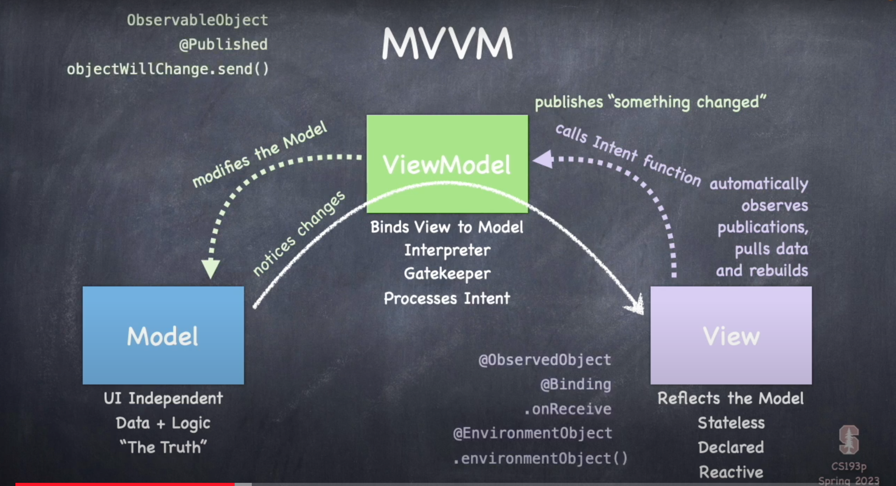

# Lecture Notes
## Lecture 3 Architecture

# MVVM
- Design Paradigm

# Model and UI
## Seperating "Logic and Data" from "UI"
- SwiftUI is very serious about the seperation of application logic & data from UI
- We call this logic and data our "Model"
- It could be a struct or an sql database or some machine learning code or REST API from the internet or many other things Or any combination of these things
- The UI is basically just a "parametizable" shell that the Model feeds and brings to life Think of the UI as a visual representation of the Model
- The model is where things like isFaceUp and cardCount would live (not in @State in the UI)
- Swift takes care of making sure the UI gets rebuilt when a Model change affects the UI

## Connecting the Model to the UI
- There are some choices about how to connect the Model to the UI...
    1. Rarely, the Model could just be a @State in a View (this is minimal to no seperation)
    2. The Model might only be accessible via a gatekeeper "ViewModel" class (full seperation)
    3. There is a View Model class, but the Model is still directly accessible (partial seperation)
- Mostly the choice depends on the complexity of the Model...
- A Model that is made up of SQL + struct(s) + something else will likely opt for #2
- A Model that is just a simple piece of data and little to no logic will likely opt for #1
- Something in-between might opt for #3
- Just always do #2 for now, it's the best choice for most things
- We're going to talk about now #2 (full seperation)
- We call this architecture that connects the Model to the UI in this way "MVVM"
- MVVM stands for Model-View-ViewModel
- This is the primary architecture for any reasonably complex SwiftUI application
- You'll also quickly see how #3 (partial seperation) is just a minor tweak to MVVM

## MVVM Diagram



# Varieties of Types

- Struct
- Class
- Protocol
- Generics "don't care type"
- enum
- functions 

## Struct & Class 
### Both Struct & Class are have:
... pretty much the same syntax

### Stored vars:
    - computed vars (i.e. those whose value is the result of evaluating some code)
    - constant lets (i.e., vars whos values never change)
``` swift
let defaultColor = Color.orange
CardView().foregroundColor(defaultColor)
```

### Functions:
``` swift
func multiply(operand: Int, by: Int) -> Int {
    return operand * by
}
multiply(operand: 5, by: 6)

//Functions can an external and internal name:

func multiply(_ operand: Int, by otherOperand: Int) -> Int {
    return operand * otherOperand
}
multiply(5, by: 6)

//"_" is the external name, "by" is the external name
// "operand" and "otherOperand" are the internal name
// Callers use the external name
```

### Initializers
    - Special functions that are called when creating a struct or class

``` swift
struct RoundedRectangle {
    init(cornerRadius: CGFloat) {
        // initialize this rectangle with a corner radius
    }
    init(cornerSize: CGSize) {
        // initialize this rectangle with a corner size
    }
}

// In the Demo

struct MemoryGame {
    init(numberOfPairsOfCards: Int) {
        // Create a Game with that many pairs of cards
    }
}
```

- 99% of the time, you'll use structs
- The Only time we will use classes is that ViewModel 

## Difference between Struct & Class

### Struct
- Value Type (Storage for value is right there)
- Copied when passed or assigned
- Copied on write ( When someone modifies it, it makes a copy of it )
- Stored in memory on the stack
- Functional Programming (Functionality Encapsulation how it behaves)
- No Inheritance
- "Free" init initializes ALL vars
- Mutability is explicit (var or let)
- Your "go to" data structure
- Everything you've seen so far is a struct (Except View which is a protocol)

### Class
- Reference Type (20 pieces of code all point to the same thing)
- Passed around via pointers 
- Automatically reference counting (In alot of languges you do garbage collection what is garbage collection, but in Swift it's reference counting it keeps track of how many things are pointing to a chunk of memory and when it gets down to zero it frees it)
- Object Oriented Programming (Data Encapsulation)
- Inheritance (single)
- "Free" init initializes NO vars 
- Always mutatable (Dangerous)
- Used in special circumstances
- ViewModel is MVVM is always a class (also, UIKit (old style iOS) is class-based)


# Generics
- Sometimes we just don't care 
- We may want to manipulate data structures in a generic way that are "type agnostic"
In other words we don't know what type something is and we don't care
- But Swift is a strongly typed language so we don't use variables and such that are "untyped"
- The Wider of a Scope you put the generic the better 
## Array
- An array is a bunch of things and it doesn't care what type they are
- But inside Array's code it has to have variables for the things it contains 
- They need types for the arguments to Array functions that do things like adding items to it 

``` swift
struct Array<Element> {
    func append(_ element: Element)
}
// The type of the arugment to append is Element a Generic Type 
```
- Array's implementation of append knows nothing about that argument and does not care 
- Element is a not any known struct or or class or protocol it's just a placeholder for a type 

### The Code for using an Array looks like this
``` swift
var names = Array<String>()
names.append("Molly")
names.append("Jake")
```
-When someone uses Array that's when Element gets determined (by Array<String> or Array<Int> etc).

### Type Parameter 
- A generic type parameter is a placeholder for a type
- Element is a generic type parameter
- Array<Element> is a generic type
- Array<String> is a generic type
- Array<Int> is a generic type
- Array<Array<Int>> is a generic type
- Array<Array<Array<Int>>> is a generic type
- Array<Array<Array<Array<Int>>>> is a generic type

### Generic Functions
- A generic function is a function that takes generic type parameters
- Example:
``` swift
func printElement(_ element: Element) {
    print(element)
}
```
# Protocol
- A protocol is sort of a "stripped down" struct or class
- It hsa functions and vars but no implementation

- A type that a value must have
- A protocol is a set of requirements
- Example:
``` swift
protocol Movable {
    func move(by: Int)
    var hasMoved: Bool { get }
    var distanceFromStart: Int { get }
}
```

- See? No implementation
- The {} on the vars just say whether is a read only var or a var that can be set
- Any typ can now claim to implement Moveable 
``` swift
struct PortableThing: Movable {
    // Must implement move(by:), hasMoved, and distanceFromStart here
    var hasMoved: Bool
    var distanceFromStart: Int
    func move(by: Int) {
        // implementation
    }
}
// Portable thing now conforms to (aka "behaves like a") Movable
// ... it's also legal (this is called "protocol inheritance") 

protocol Vehicle: Movable {
    var passengerCount: Int { get set }
}
class Car: Vehicle {
    //must implement move(by:), hasMoved, distanceFromStart, and passengerCount here
}
// implements Multiple Protocols
class Car: Vehicle, Impoundable, Leaseable {
    //must implement move(by:), hasMoved, distanceFromStart, passengerCount
    // must implement any func/vars in Impoundable and Leaseable here too
}
```
## What do we use Protocols for?
- Protocol is a type
- It can be used in the normal places you might see a type with certain restrictions 
- especially with the addition with some and any
- For Example it can be the type of a var or a return type (like a var body's return type)
- Specifying a protocol the behavior of a struct, class or enum
struct ContentView: View 
- just by doing this ContentView becomes a very powerful struct!
- Of course ContentView did have to implement var body to particpate in being a View, but still
- We call this process "constrains and gain"
- A protocol can constrain another type (ex: a View has to implement var body)
- We're going to see a Variety of protocols in the coming weeks 
- Ex: Identifiable, Hashable, Equatable, CustomStringConvertible
- And more specialized ones like: Animatable
- Protocols turning "don't cares" into "somewhat cares"
``` swift
struct Array<Element> where Element: Equatable 
// This means you could only put things into the array that u could do == on
```
- If Array was declared like this, then the only things that are Equatable can be in the array
- This is the heart of "protocol oriented programming"
- A protocol becomes massively more powerful via something called an extension 
- Using protocols as types some and any keywords help us do that 

## Functions as Types 
- You can declares a variable ( or parameter to a func or whatever) to be a function type
- This syntax for this includes the type of the argument and the type of the return value
- You can do this anywhere any other type is allowed
- Example:
``` swift
(Int, Int) -> Bool // takes two Ints and returns a Bool
(Double) -> Void // takes a Double and returns nothing
() -> Array<String> // takes no arguments returns an Array of Strings
// All of the above are just types 
// No different than Bool or View or Array<Int>. All are types 

var foo: (Double) -> Void // foo's types: "Function that takes a Double and returns nothing"
func doSomething(what: () -> Bool) // what's type: "Function that takes no arguments and returns a Bool"

```
### Functions are Types 
``` swift
var operations: (Double) -> Double 
// This is a var called operation: It's type is a function that takes a Double and returns a Double

// Here's Simple function that takes a double and returns a double
func square(operand: Double) -> Double {
    return operand * operand
}
// This is a function that takes a double and returns a double
// So it matches the type of operations
// Therefore we can do this:
operations = square // just assigning a value to the operation var, nothing more
let result1 = operation(4) // result1 is 16
// Note that we don't use argument labels (eg. operand) when executing function types
operation = sqrt // sqrt is a built in function that takes a double and returns a double
let result2 = operation(4) // result2 is 2
```

## Closues 
- We also call them inline functions or lambdas
- It's so common to pass functions around that we are very often "inlining" them
- We've already used this alot (@ViewBuilders are closures, so is on onTapGesture's action)
- We'll peel back the layers on this in the demo and again in the quarter 


Garbage collection is basically when you have a reference to a class that say you have variable X equals this class let's say nothing else is pointing to that class right just that variable nothing is using. Nothing is you know nothing is like a sign to it other than the class. At random, the system will decide it's time to look at all of the references in the entire in the entire project and anything that's not being used get rid of it. Get rid of any class that doesn't have something pointing to it. Get rid of any thing that's not in use however the difference between garbage collection and like automatic reference counting or manual memory management is that this happens at random the system will randomly go. OK there's not a lot of work happening. It's time to clear out the memory or there is a lot of work happening we need this memory. Let's go kill a reference to everything that isn't in active use. So that's basically what garbage collection is it just a computer sign deciding OK we need to now free up this memory and we do so by looking at all of the references to all the classes and all the variables and if no one's using it, kill it and get rid of it and then we have more memory

So it's actually a language specific feature so like in Java there's something called the Java virtual machine that executes Java it's a feature of basically the compiler so The compiler for swift is called LLDB low-level shit LLDB but that's the thing that you can type commands in and get like specific output in the console of Xcode, but It's a specific feature it's not like I guess I mean it is a program but don't it's not like an app you know what I mean like it's it's the compiler like how V8 is that whatever the engine for JavaScript do you know what I mean for web stuff

Swift uses a different method of memory management called ARC automatic reference counting basically if you have a pointer pointing to something then it will stay in memory and then when the pointers no longer pointing to it then everything is then it's it's killed the memory that hold it is killed And that's a very efficient form of memory


# Lecture 4 
import Foundation

// Model
struct MemoryGame<CardContent> {
    private(set) var cards : Array<Card>
    
    init(numberOfPairsOfCards: Int, cardContentFactory: (Int) -> CardContent){
        // you job inside ur init is to initalize all ur vars
        cards = [] // this is a literal array we did it with our emojis
        // add numberOfPairsOfCards x 2 cards
        // remove pairIndex replace with _ cuz we dont use pair index in the for loop
        for pairIndex in 0 ..< max(2, numberOfPairsOfCards) {
            let content = cardContentFactory(pairIndex)
            // free initalizer cuz im a struct
            cards.append(Card(content: content))
            cards.append(Card(content: content))
        }
    }
    
    func choose(_ card: Card){
        
    }
    //Cannot use mutating member on immutable value: 'self' is immutable
    // Any function that modifies the model has to be marked mutating
    mutating func shuffle(){
        cards.shuffle()
        print(cards)
        
    }
    
    struct Card {
        var isFaceUp = true
        var isMatched = false
        let content: CardContent
        
    }
    
}
    // We never had any init intializer for our CardView. Classes did the same thing but
    // their initializers have no arguments so they only work if all of your variables
    // have no arguments it only works all your variables have default values and we have a
    // variable right here model that has no value so that's why it's saying
    // "i cant give you the free initializer here because you have some unitialized value
    //since you have some unitialized variables so u have no intitalizers plesae "give me one" it's saying
    // so i could give it an init and we're going to see init her ein a second here in our model but instead im going
    // to try to give this
    //private var model: MemoryGame<String> as value
    //private var model: MemoryGame<String> = MemoryGame<String> () with no arguments possibly
    // can i do that no because there's  a missing argument cards okay MemoryGame<String> is a struct
    //it's free initalizer lets me initialize all of the variables and if i go back here and look at
    // at my model it's going an unitialized variable which the cards the cards of array
    // from MemoryGame.swift :   private(set) var cards : Array<Card> <-
    // You've got to provide those cards:
    //  private var model: MemoryGame<String>(cards: <- this makes no sense for cards to be the argument
    // so this is where intializers come in what does make sense is numberOfPairsOfCards: 4)
    // ->   private var model: MemoryGame<String> = MemoryGame<String>(numberOfPairsOfCards: 4)
    // we're going to have to create an init in MemoryGame.swift
    
    // closure
    // if the last argument is to a function or a creation what can we do with it ? throw it on the outside closure syntax
    // trailing closure take closure out of parenthessis
    /*
     for example :
     performOperation(numbers: [1, 2, 3], operation: { (nums) in
         print(nums)
     })
     to this :
     performOperation(numbers: [1, 2, 3]) { (nums) in
         print(nums)
     }
     explaination: { (nums) in print(nums) } is not longer surrounded by ()
     
     if i were to replace index with $0 $0 is a special name okay $0 means first argument i could have $1
         let emojis =  ["👻", "🐮", "🍓", "🫐", "👀", "🐶", "🐱", "🦊", "🐻", "🦁", "🐸", "🐧", "🐢", "🐙", "🐝", "🐼", "🦄"]

     you cant put variables before intializers in a class because you ont know whether emojis will be read yet to be able call it in the initializer 
     
     you could make it global but everyone in this class knows we dont use gloabl variables
     
     the solution is to add it back in to the class but add the word static to the front what it means is make emojis global
     but namespace it inside of my class
     
     static let emojis =  ["👻", "🐮", "🍓", "🫐", "👀", "🐶", "🐱", "🦊", "🐻", "🦁", "🐸", "🐧", "🐢", "🐙", "🐝", "🐼", "🦄"]
     to call this you say EmojiMemoryGame.emojis[pairIndex]
     
     and you can also add the word private now it's a private global variable only for us to use 
     but another cool feature not really type inference but swift if youre doing a property intializer like these and you use one of these namespace globals you dont have to put the extra thing EmojiMemoryGame.emojis[pairIndex]
     
    it will figure it out you can just put emojis[pairIndex]
    
        // what if i want to make a lil function to create my model
    private var model = createMemoryGame()
    func createMemoryGame(){
        
        return MemoryGame(numberOfPairsOfCards: 4 ) { pairIndex in
            return EmojiMemoryGame[pairIndex]
        }
    }
 
    Cannot use instance member 'createMemoryGame' within property initializer; property initializers run before 'self' is available
        cant use a function before i can intialize my class 
        how do we fix that also with static
            func createMemoryGame(){
        
        static return MemoryGame(numberOfPairsOfCards: 4 ) { pairIndex in
            return EmojiMemoryGame[pairIndex]
        }
    }
    
    return types can never be infered in swift
    
        static let emojis =  ["👻", "🐮", "🍓", "🫐", "👀", "🐶", "🐱", "🦊", "🐻", "🦁", "🐸", "🐧", "🐢", "🐙", "🐝", "🐼", "🦄"]
    
    // what if i want to make a lil function to create my model
   // i would like to put my statics at the top they're global to my entire thing so i want them to be listed first 
    
    private static func createMemoryGame() -> MemoryGame<String>{
        return MemoryGame(numberOfPairsOfCards: 4 ) { pairIndex in
            return  emojis[pairIndex]
        }
    }
    
    private var model = createMemoryGame()
    
    var cards: Array<MemoryGame<String>.Card>{
        return model.cards
    }
    func choose(_ card: MemoryGame<String>.Card){
        model.choose(card)
    }
}
    When we say "some View" for the Var body it's not inferrring its actually looking in there and setting it to be that 
             // .purple is actually Color.purple this is type color it's a truct and .purple is just a non private
        // static var
        // option click thats how u can see the documentation
        .foregroundColor(Color.purple)
        
            //Cannot use mutating member on immutable value: 'self' is immutable
    // Any function that modifies the model has to be marked mutating
    mutating func shuffle(){
        cards.shuffle()
    }
        // We have to get our view model reactive so that the cards shuffle so that something changes we do that by implementing
// the protocol: Observable object
class EmojiMemoryGame : ObservableObject {
    static let emojis =  ["👻", "🐮", "🍓", "🫐", "👀", "🐶", "🐱", "🦊", "🐻", "🦁", "🐸", "🐧", "🐢", "🐙", "🐝", "🐼", "🦄"]
        // if you put published @Published on a var that if this var changes it will say something changed
    @Published private var model = createMemoryGame()
    
    
    
    // instead of the equal sign at the bottom in the preview pass the view model to content view 
    struct ContentView_Previews: PreviewProvider {
    static var previews: some View {
        ContentView(viewModel: EmojiMemoryGame())
    }
}
also change it in your app : //
// so apps like views can have @StateObjects
// somewhere there needs to be @State
import SwiftUI

@main
struct MemorizwiftApp: App {
    @StateObject var game = EmojiMemoryGame
    var body: some Scene {
        WindowGroup {
            ContentView(viewModel: game)
        }
    }
}


     */


# Lecture 5: Enums and Optionals

- it can only have discrete status 
## Enum

- Enums are another variety of data structure in addition to `struct` and `class`. 
- Enums can only have discrete states.

```swift
enum FastFoodMenuItem {
    case hamburger
    case fries
    case drink
    case cookie
}
```

- An enum is a **value type** (like `struct`), so it is copied and passed around.

### Associated Data

- Each state of an enum can (but does not have to) have its own 'associated data'.

```swift
enum FastFoodMenuItem {
    case hamburger(numberOfPatties: Int)
    case fries(size: FryOrderSize)
    case drink(String, ounces: Int)
    case cookie
}
```

- The `drink` case has two pieces of associated data, one of them unnamed.
- In the example above, `FryOrderSize` would likely also be an enum:

```swift
enum FryOrderSize {
    case large
    case small
}
```

### Setting a Value of an Enum

- Use the type name and the case you want, separated by a dot.

```swift
let menuItem: FastFoodMenuItem = FastFoodMenuItem.hamburger(numberOfPatties: 2)
var otherItem: FastFoodMenuItem = FastFoodMenuItem.cookie
var yetAnotherItem = .cookie // Swift can infer this
```

### Checking an Enum's State

- Enum states are usually checked with a `switch` statement (an `if` statement is unusual, especially if there is associated data).

```swift
var menuItem = FastFoodMenuItem.hamburger(numberOfPatties: 2)

switch menuItem {
    case .hamburger: print("burger")
    case .fries: print("fries")
    case .drink: print("drink")
    case .cookie: print("cookie")
}
```

- It's not necessary to fully write out `FastFoodMenuItem.fries` inside the `switch` (since Swift can infer it).

### `break` in Switch

- If you don't want to do anything for a given case, use `break`.

```swift
switch menuItem {
    case .hamburger: break
    case .fries: print("fries")
    case .drink: print("drink")
    case .cookie: print("cookie")
}
```

- This code would print nothing to the console.

### `default` in Switch

- A `switch` must handle all possible cases, though you can use `default` to handle uninteresting cases.

```swift
switch menuItem {
    case .hamburger: break
    case .fries: print("fries")
    default: print("other")
}
```

- If `menuItem` is a `cookie`, the above would print "other".

### Multiple Lines in Switch Cases

- Each case in a `switch` can have multiple lines and does **not** fall through to the next case unless specified with `fallthrough`.

```swift
switch menuItem {
    case .hamburger: print("burger")
    case .fries:
        print("yummy")
        print("fries")
    case .drink: print("drink")
    case .cookie: print("cookie")
}
```

- The above code would print "yummy" and "fries" but not "drink".

### Accessing Associated Data

- Associated data can be accessed in a `switch` using the `let` syntax.

```swift
switch menuItem {
    case .hamburger(let pattyCount): print("a burger with \(pattyCount) patties!")
    case .fries(let size): print("a \(size) order of fries!")
    case .drink(let brand, let ounces): print("a \(ounces)oz \(brand)")
    case .cookie: print("a cookie!")
}
```

### Methods in Enums

- Enums can have methods and computed properties but no stored properties.

```swift
enum FastFoodMenuItem {
    case hamburger(numberOfPatties: Int)
    case fries(size: FryOrderSize)
    case drink(String, ounces: Int)
    case cookie

    func isIncludedInSpecialOrder(number: Int) -> Bool {
        switch self {
            case .hamburger(let pattyCount): return pattyCount == number
            case .fries, .cookie: return true
            case .drink(_, let ounces): return ounces == 16
        }
    }
}
```

- The above method checks if the item is included in a special order (e.g., a 16oz drink or a burger with a specific number of patties).

### Getting All Cases of an Enum

- Use the `CaseIterable` protocol to get all cases of an enum.

```swift
enum TeslaModel: CaseIterable {
    case X
    case S
    case Three
    case Y
}

for model in TeslaModel.allCases {
    reportSalesNumbers(for: model)
}
```

## Optionals

- An `Optional` is just an enum. It essentially looks like this:

```swift
enum Optional<T> {
    case none
    case some(T)
}
```

- Optionals can have two states: `.none` (nil) or `.some(T)` (with associated data of type `T`).

### Declaring Optionals

- Declaring an optional can be done with the syntax `T?`.

```swift
var hello: String? = "hello"
var goodbye: String? = nil
```

- You can also use the fully expressed `Optional<T>` form:

```swift
var hello: Optional<String> = .some("hello")
var goodbye: Optional<String> = .none
```

### Accessing the Value of an Optional

- Access the value of an optional either by force (`!`) or safely using `if let`.

```swift
if let safeHello = hello {
    print(safeHello)
} else {
    print("hello is nil")
}
```

### Nil-Coalescing Operator `??`

- The `??` operator provides a default value if the optional is nil.

```swift
let x: String? = nil
let y = x ?? "default value"
```

- In this case, `y` will be assigned "default value" if `x` is nil.

# Lecture 6: Layout in SwiftUI

## Layout: How is Space Apportioned to Views?

It's amazingly simple ...

- **Container Views** “offer” some or all of the space offered to them to the Views inside them.
- **Views** then choose what size they want to be (they are the only ones who can do so).
- **Container Views** then position the Views inside of them.

This describes the basic flow of layout in SwiftUI where container views manage space distribution, and views decide their own size preferences.

## Layout: HStack and VStack

### Stacks Dividing Space

- Stacks divide up the space offered to them and then offer that to the Views inside.
- The stack offers space to its “least flexible” subviews first.

**Examples**:
- **Inflexible View**: `Image` (it wants to be a fixed size).
- **Slightly more flexible View**: `Text` (always wants to size exactly to fit its text).
- **Very flexible View**: `RoundedRectangle` (always uses any space offered).

Once a View takes the space it wants, its size is removed from the available space, and the stack moves on to the next “least flexible” Views. Very flexible views share evenly.

### Spacer and Divider

- **Spacer(minLength: CGFloat)**
  - Takes all the space offered.
  - Draws nothing.
  - `minLength` defaults to platform-appropriate spacing.

- **Divider()**
  - Draws a dividing line crosswise to the stack direction.
  - Takes the minimum space to fit the line, and all crosswise space.

These views are essential for creating flexible, visually organized layouts in SwiftUI.

### layoutPriority(Double)

This can override which views get space first, regardless of their flexibility. By default, all views have a layout priority of 0.

```swift
HStack {
    Text("Important").layoutPriority(10)  // Higher priority
    Image(systemName: "arrow.up")  // Default priority (0)
    Text("Unimportant")
}
```

The `Text("Important")` will get the space it needs first due to its higher layout priority. Then, the `Image` will get its space because it is less flexible than the `Text("Unimportant")`. Finally, the `Text("Unimportant")` will fit into any remaining space, and if it doesn't get enough space, it may be truncated (e.g., "Swift is..." instead of "Swift is great!").

## Alignment in HStack and VStack

When stacking views with different widths, alignment determines their positioning (e.g., left-aligned, centered).

```swift
VStack(alignment: .leading) { 
    // Views go here
}
```

- **.leading** adjusts automatically for text flow direction (e.g., right-to-left languages like Arabic or Hebrew).
- Text baselines can also be used for alignment:

```swift
HStack(alignment: .firstTextBaseline) {
    Text("SwiftUI")    // Aligned by the first text baseline
    Text("Layouts")
}
```

You can also define your own alignment guides, though this is beyond the scope of this lecture.

## LazyHStack and LazyVStack

- **LazyHStack** and **LazyVStack**: These “lazy” stacks only build views that are currently visible.
  - They don’t take up all the space offered, even if they contain flexible views.
  - **Use case**: Ideal when the stack is within a `ScrollView`.

## LazyHGrid and LazyVGrid

- **LazyHGrid** and **LazyVGrid**: These grids size their views based on the configuration (e.g., number of columns in a grid).
  - The opposite direction (perpendicular to the grid’s axis) can grow or shrink as more views are added.
  - **Efficiency**: The grid does not take up all the space if it doesn’t need it.
  
## Grid

- **Grid**: A general-purpose grid that allocates space to its views both horizontally and vertically (hence no “H” or “V”).
  - Offers alignment options for both columns and rows using grid modifiers like `gridColumnAlignment()` and `gridRowAlignment()`.
  - **Use case**: Often used to create a "spreadsheet" or tabular display of data.

## ScrollView

- **ScrollView**: Takes up all the space offered to it and enables scrolling along a specified axis.
  - The views inside a `ScrollView` are sized to fit along the axis of scrolling (e.g., horizontally or vertically).

## ViewThatFits

- **ViewThatFits**: Chooses from a list of container views (e.g., `HStack`, `VStack`) and picks the one that best fits the available space.
  - Useful for handling different layouts in landscape vs. portrait mode, or accommodating dynamic type sizes (like larger fonts).

## Advanced Stacks: Form, List, OutlineGroup, and DisclosureGroup

- These views act like "smart" VStacks with additional functionality, such as scrolling, selection, and hierarchy.

  - **Form**: Used for building structured input forms.
  - **List**: Displays rows of data in a scrollable container.
  - **OutlineGroup**: Ideal for showing hierarchical data.
  - **DisclosureGroup**: Collapsible container for showing/hiding content.

## Custom Implementations of the Layout Protocol

- You can create custom views by implementing the **Layout** protocol.
  - This allows complete control over the "offer space, let views choose their size, then position them" process using methods like `sizeThatFits` and `placeSubviews`.

## ZStack

- **ZStack**: Stacks views on top of one another, with the last view being on top.
  - Sizes itself to fit its children, and if one child is flexible, the entire stack will be flexible as well.

### .background Modifier

```swift
Text("hello").background(Rectangle().foregroundColor(.red))
```

This works like a mini-ZStack, where the `Text` controls the layout. The `Rectangle` just adds background color without impacting the layout size.

### .overlay Modifier

```swift
Circle().overlay(Text("Hello"), alignment: .center)
```

In this example, the Circle is fully flexible and determines the overall size, with the `Text` stacked on top and centered.

## Modifiers in SwiftUI

### Modifiers and Layout

- Modifiers, such as `.padding`, return a modified view and can adjust how space is distributed.

```swift
Text("SwiftUI Layout").padding(10)
```

This applies 10 points of padding around the text, adjusting its total size.

### .aspectRatio Modifier

The `.aspectRatio` modifier controls how a view resizes to fit within its available space while maintaining a specified aspect ratio.

```swift
Image(systemName: "photo").aspectRatio(contentMode: .fit)
```

The view returned by `.aspectRatio` can choose to either:
- **.fit**: The content will resize to fit inside the available space while maintaining its aspect ratio.
- **.fill**: The content will expand to fill the entire available space while maintaining its aspect ratio, which may result in some content being cropped.

## GeometryReader

The `GeometryReader` view allows you to access information about the size and position of its parent container.

```swift
var body: some View {
    GeometryReader { geometry in
        Text("Width: \(geometry.size.width), Height: \(geometry.size.height)")
    }
}
```

The `geometry` parameter is a **GeometryProxy**, which provides:
- **size**: The total space offered by the parent container (`CGSize`).
- **frame(in:)**: The view's frame in a specific coordinate space (`CGRect`).
- **safeAreaInsets**: Insets around the safe area (`EdgeInsets`).

### Key Point:

`GeometryReader` itself always accepts all the space offered to it, meaning it will expand to fill the available space. It's particularly useful for adjusting the layout based on the view's size or position within the interface.

### Example of GeometryReader:

```swift
GeometryReader { geometry in
    Text("Available width: \(geometry.size.width), Available height: \(geometry.size.height)")
}
```

In this example, `GeometryReader` provides the width and height of the parent container, allowing the layout to adapt dynamically based on the available space.

## Safe Area

The **safe area** represents portions of the screen where views should not draw content, such as the area around the notch on iPhones or the home indicator.

By default, views are constrained to avoid drawing into the safe area, but this behavior can be overridden using the `.edgesIgnoringSafeArea` modifier.

```swift
ZStack {
    Text("Hello, World!")
}.edgesIgnoringSafeArea([.top])
```

In this example, the `ZStack` content is allowed to extend into the top safe area, overriding the default layout behavior. This can be useful for creating full-screen content or when you want the content to span the entire screen, including areas normally reserved for system elements.

By using `.edgesIgnoringSafeArea`, you can selectively allow content to be drawn into areas that are typically protected by the safe area.
